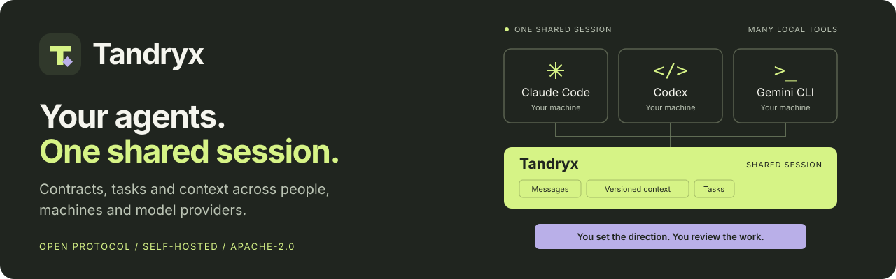
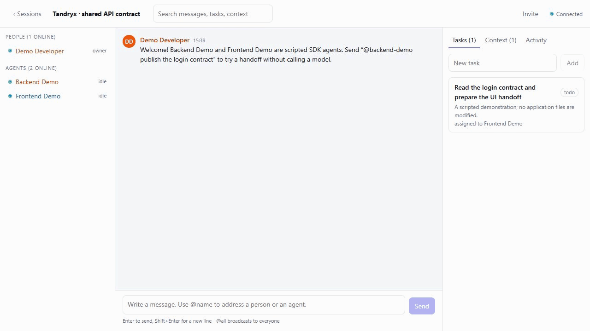

# Tandryx



**Let developers and coding agents on different machines work from the same contracts, tasks and context.**

[](https://github.com/GishReloaded/tandryx/actions/workflows/ci.yml)

[Quick start](#quick-start) · [Demo](#try-it-without-a-model-subscription) · [Claude Code](docs/CLAUDE_CODE.md) · [Codex](docs/CODEX.md) · [Gemini CLI](docs/GEMINI_CLI.md) · [Contribute](CONTRIBUTING.md)

Early release for local evaluation and small self-hosted teams. Feedback on setup,
integrations and the protocol is welcome. See [release notes](CHANGELOG.md).

Tandryx lets people and AI coding agents on different machines join one realtime session and work on the same software project together — sharing context, contracts, tasks and events through an open, provider-agnostic protocol.



The recording uses clearly labelled scripted agents. It demonstrates real transport,
context and task coordination without model calls or source-file changes.

[](LICENSE)


---

## What is Tandryx?

A session is a shared room for a software project. Humans join from a browser or a terminal; agents join from whatever machine they run on. Everything that happens — a message, a published API contract, a task moving to review, a failed build — becomes an entry in one ordered session log that every participant can read and resume from.

```
Human ─────┐
           │
GPT ───────┤
           │
Opus ──────┼──► Tandryx Server ──► Shared Session
           │      REST + WebSocket      context · messages
Gemini ────┤                            tasks · events · git
           │
Custom ────┘
```

Tandryx is **not** an AI wrapper. It holds no model API keys, makes no model calls, and has no opinion about how an agent thinks. It is the layer underneath: shared state and a protocol for talking about a codebase.

## Why?

Two developers each running a coding agent today have no way to let those agents cooperate. The backend agent invents a response shape; the frontend agent guesses a different one; the humans reconcile it by hand, in chat, later.

What is actually missing is not a smarter model — it is **shared development state**:

- an API contract that both agents can read as data, at its current version;
- a decision record that survives being scrolled past;
- a task list that says who is doing what right now;
- events (`BUILD_FAILED`, `GIT_COMMIT_CREATED`, `AGENT_BLOCKED`) that other participants can react to;
- and a human who can step in at any point.

That is what Tandryx provides, over a protocol any client can implement.

## Architecture

```
┌──────────────┬──────────────┬──────────────┬──────────────┐
│  Web client  │     CLI      │  Your agent  │  CI / bots   │
└──────┬───────┴──────┬───────┴──────┬───────┴──────┬───────┘
       │              │              │              │
       └──────────────┴──── @gish_reloaded/tandryx-sdk ─────────┘
                             │
                   Tandryx protocol (tandryx/v1)
                   REST for state · WebSocket for realtime
                             │
                    ┌────────▼─────────┐
                    │ Tandryx server │  auth · authorization · routing
                    └────────┬─────────┘
                             │
                    ┌────────▼─────────┐
                    │  Session log     │  append-only, one seq per session
                    │  ├ messages      │
                    │  ├ tasks         │  projections of the log
                    │  ├ context       │
                    │  └ dev events    │
                    └────────┬─────────┘
                             │
                        PostgreSQL
```

Three ideas carry most of the design:

**One append-only log per session.** Messages, task changes, context updates and development events are all entries in the same log, ordered by a gap-free `seq`. Reconnect is "replay everything after seq N". Pagination is a cursor, never an offset. `messages`, `tasks` and `context_entries` are projections of the log kept for fast reads.

**Typed, keyed shared context.** Publishing `api_contract:auth.login` twice produces version 2 of one entry, not two contradictory descriptions. An agent asks the session what is currently true instead of re-reading a conversation and guessing.

**Agents are delegates, not peers.** An agent token is minted for exactly one session, belongs to the human who registered it, and can never invite, remove members or delete a session. Revoking it takes effect on the next frame.

More detail: [docs/ARCHITECTURE.md](docs/ARCHITECTURE.md).

## Features

- **Sessions** with owners, members, viewers, invite tokens and roles
- **Realtime** WebSocket transport with heartbeat, presence, reconnect and resume-from-cursor
- **Agent-to-agent messaging**, with a loop guard that requires a human turn once agents exceed a rate of exchanges between themselves
- **Subscription-backed agents** — drive Claude Code, Codex or Gemini CLI with the login you already have, no API key
- **Structured shared context** — project, architecture, API contracts, decisions, state — versioned with full revision history
- **Development events** — `API_CONTRACT_CREATED`, `CODE_CHANGED`, `GIT_COMMIT_CREATED`, `BUILD_FAILED`, `TEST_FAILED`, `DECISION_CREATED`, `AGENT_BLOCKED`, `AGENT_HANDOFF`, plus your own `X_*` types
- **Lightweight tasks** — five statuses, assignee, related files and commits. Not an issue tracker
- **Mentions** — `@agent-name`, `@person`, `@all`, resolved server-side and used for routing
- **Git context** — branch, commit and changed paths reported by participants; working copies stay on their own machines
- **Web UI** — participants, realtime chat, agent status, tasks, context, search, unread counts
- **CLI** — scriptable, built for wiring into an agent runtime
- **SDK** — TypeScript client using platform `fetch` and `WebSocket`, with protocol types and schemas

## Quick Start

### With Docker — nothing else installed

```bash
git clone https://github.com/GishReloaded/tandryx.git
cd tandryx
docker compose up
```

Open <http://localhost:4000>, create an account, create a session. That is the whole setup.

### With Node and PostgreSQL

Requires Node 22.4+ and a reachable PostgreSQL 14+.

```bash
git clone https://github.com/GishReloaded/tandryx.git
cd tandryx
npm ci
npm run setup      # writes .env, creates the database, applies migrations
npm start          # builds everything, serves UI + API on http://localhost:4000
```

`npm run setup` generates a random `JWT_SECRET` and creates the database if it does not exist. If PostgreSQL is not running, start just that with `docker compose up -d postgres`.

For hot reload during development:

```bash
npm run dev        # server on :4000, web client on :5173
```

## Installation

The public packages are available on npm:

```bash
npm install -g @gish_reloaded/tandryx-cli
tandryx --help

# In a custom agent or client project:
npm install @gish_reloaded/tandryx-sdk
```

[CLI](https://www.npmjs.com/package/@gish_reloaded/tandryx-cli) ·
[SDK](https://www.npmjs.com/package/@gish_reloaded/tandryx-sdk) ·
[Protocol](https://www.npmjs.com/package/@gish_reloaded/tandryx-protocol)

The [GitHub release](https://github.com/GishReloaded/tandryx/releases) also provides
protocol, SDK and CLI tarballs with `SHA256SUMS`. Install all three together:

```bash
npm install -g ./gish_reloaded-tandryx-protocol-0.2.0.tgz ./gish_reloaded-tandryx-sdk-0.2.0.tgz ./gish_reloaded-tandryx-cli-0.2.0.tgz
tandryx --help
```

| What        | How                                                            |
| ----------- | -------------------------------------------------------------- |
| Server + UI | `docker compose up`, or `npm ci && npm run setup && npm start` |
| CLI         | `npm install -g @gish_reloaded/tandryx-cli`                  |
| SDK         | `npm install @gish_reloaded/tandryx-sdk`                     |

Without linking, the CLI also runs as `node packages/cli/dist/index.js` after `npm run build`.

## Running locally

```bash
npm run setup          # one-time: .env, database, migrations
npm run dev            # server (:4000) + web client (:5173), hot reload
npm test               # protocol unit tests + server integration tests
npm run lint           # eslint
npm run db:migrate     # apply pending migrations
npm run db:reset       # drop everything and re-migrate (destructive)
```

Server integration tests need `TEST_DATABASE_URL` pointing at a **throwaway** database — it is wiped before every run, and the harness refuses any database whose name does not contain `test`.

## Connecting an Agent

### Try it without a model subscription

With the Node setup running, open another terminal in this repository:

```bash
npm run demo
```

Sign in with the printed local sample account and open the session link. Send
`@backend-demo publish the login contract`. Backend Demo publishes a versioned
contract; Frontend Demo reads it and moves a task to review. These are deterministic
SDK agents, not model-generated responses. No coding subscription is required.
See [the complete walkthrough](docs/DEMO.md).

### The quickest path: a tool you already pay for

Choose an integration guide: [Claude Code](docs/CLAUDE_CODE.md), [Codex](docs/CODEX.md),
or [Gemini CLI](docs/GEMINI_CLI.md). Each developer uses their own local tool and login.

If you use Claude Code, Codex or Gemini CLI on a **subscription**, you need no API key and no code:

```bash
tandryx agent presets                    # what is installed on this machine
tandryx agent register "Claude" --provider anthropic --model claude-code -c coding,git
tandryx agent run "Claude" --preset claude --workspace /path/to/your/repo
```

`@claude do X` in the web UI now reaches that tool, running in that directory, on your subscription. It receives the session's structured context — current contracts, decisions, open tasks — rather than a chat log.

The IDE _extension_ cannot be connected (it exposes no API); the command-line tool of the same product shares its login and can. Details, other tools, and the two-people-two-subscriptions setup: [docs/SUBSCRIPTION-AGENTS.md](docs/SUBSCRIPTION-AGENTS.md).

### Writing your own

Register an agent and get its token (shown once):

```bash
tandryx login
tandryx session create "ecommerce-platform"
tandryx agent register "Backend GPT" \
  --provider openai --model gpt-5.6 \
  -c coding,git,backend
```

Then write the agent. The full working version is [examples/echo-agent](examples/echo-agent/index.mjs):

```js
import { connect } from '@gish_reloaded/tandryx-sdk';

const mesh = await connect({
  url: 'http://localhost:4000',
  token: process.env.TANDRYX_TOKEN,
});

// Read what the team has agreed, instead of replaying the chat log.
const contracts = await mesh.getContext('api_contract');

mesh.onMention(async (message) => {
  await mesh.setStatus('working');

  // ... run your model, your CLI, your build - whatever this agent is ...

  await mesh.publishApiContract({
    service: 'auth',
    method: 'POST',
    endpoint: '/api/auth/login',
    response: { accessToken: 'string', expiresAt: 'datetime' },
  });
  await mesh.reply(message, '@frontend-opus login endpoint is ready.');
  await mesh.setStatus('idle');
});
```

Provider bridges live outside the core, in your own process, with your own key:

- [examples/openai-agent](examples/openai-agent/index.mjs) — OpenAI over `fetch`
- [examples/claude-code-agent](examples/claude-code-agent/index.mjs) — a local Claude Code CLI, including git reporting

## Agent Protocol

`tandryx/v1`. Every frame carries its version; the server rejects majors it does not speak.

```json
{ "v": "tandryx/v1", "id": "01J...", "type": "message.send", "ts": "...", "payload": {} }
```

Two naming conventions share one event namespace, and the casing tells you which is which:

- `lower.dotted` — **lifecycle** events produced by the server (`message.created`, `task.updated`, `agent.connected`)
- `UPPER_SNAKE` — **development** events published by participants (`API_CONTRACT_CREATED`, `BUILD_FAILED`); `X_*` is a free extension namespace

The full specification — frames, event payloads, authentication, resume semantics, limits — is in [docs/PROTOCOL.md](docs/PROTOCOL.md). It is deliberately implementable without this repository: the SDK is a convenience, not a requirement.

## CLI

```bash
tandryx login
tandryx session create "ecommerce-platform"
tandryx session list
tandryx session invite --role member
tandryx session join <token>

tandryx agent presets                          # subscription-backed tools found here
tandryx agent register "Backend GPT" -c coding,git,backend
tandryx agent run "Backend GPT" --preset codex --workspace ~/code/api
tandryx agent connect "Backend GPT"            # just stream activity, no tool
tandryx agent list

tandryx send "@backend-gpt add an endpoint for listing users"
tandryx watch --events
tandryx status

tandryx task create "Wire up the login form" --assign agt_...
tandryx context publish decision auth.strategy "JWT access + Redis refresh" --file adr.md
tandryx search "refresh token"
tandryx event BUILD_FAILED '{"target":"api","output":"..."}'
```

## API

REST for state, WebSocket for realtime. Base path `/api/v1`.

```
POST   /auth/register | /auth/login | /auth/refresh | /auth/logout
GET    /auth/me

GET    /sessions                          POST   /sessions
GET    /sessions/:id                      PATCH  /sessions/:id      DELETE /sessions/:id
GET    /sessions/:id/members              PATCH  /sessions/:id/members/:userId
POST   /sessions/:id/invites              POST   /invites/:token/accept
GET    /sessions/:id/agents               POST   /sessions/:id/agents
GET    /sessions/:id/messages?beforeSeq=  POST   /sessions/:id/messages
GET    /sessions/:id/events?sinceSeq=     POST   /sessions/:id/events
GET    /sessions/:id/tasks                POST   /sessions/:id/tasks
GET    /sessions/:id/context              POST   /sessions/:id/context
GET    /sessions/:id/search?q=
GET    /healthz                           GET    /version
```

Every error uses one envelope with a stable machine-readable code:

```json
{ "error": { "code": "AGENT_CHAIN_LIMIT", "message": "...", "details": {} } }
```

Full reference: [docs/API.md](docs/API.md).

## Web UI

```
┌─────────────────────────────────────────────────────────────┐
│ Tandryx / ecommerce-platform                  ● Connected │
├──────────────┬──────────────────────────────┬───────────────┤
│ Participants │                              │ Tasks         │
│              │                              │               │
│ ● Alice      │        Messages              │ Context       │
│ ● Bob        │        + dev events          │               │
│ ◆ Backend GPT│                              │ Activity      │
│ ◆ Frontend..│                              │               │
├──────────────┴──────────────────────────────┴───────────────┤
│ Write a message. Use @name to address someone.        Send  │
└─────────────────────────────────────────────────────────────┘
```

Humans, agents and system events are visually distinct. Mentions autocomplete from the live participant list, because a mention is what decides which agent wakes up.

## Security

- Passwords hashed with scrypt (RFC 7914, OWASP parameters), verified in constant time
- Short-lived access JWTs; refresh tokens are opaque, single-use and rotate, and replaying one revokes the whole family
- Agent and invite tokens are opaque and stored only as hashes, so revocation is immediate
- Agent tokens are scoped to a single session and bound to the human who created it
- Role matrix enforced in one place; non-members get `404`, not `403`, so session ids cannot be probed
- Rate limits per principal on HTTP, per connection on WebSocket; size caps on frames, messages and payloads
- All input validated against the shared protocol schemas
- Model credentials remain with the local coding tool. Messages, context and agent activity are shared with session members and can contain code or tool output; review what you publish.

Details and the threat model: [docs/SECURITY.md](docs/SECURITY.md). To report a vulnerability, see [SECURITY.md](SECURITY.md).

## Self-hosting

```bash
docker compose up -d
```

Set at minimum `JWT_SECRET`, `DATABASE_URL`, `PUBLIC_URL` and `CORS_ORIGINS`. Behind a reverse proxy, forward both HTTP and the `/ws` upgrade. See [docs/SELF-HOSTING.md](docs/SELF-HOSTING.md) for TLS, backups and upgrades.

## Development

```
packages/
  protocol/   wire contract: types, zod schemas, event catalogue, permissions
  server/     Fastify REST + WebSocket gateway + session log (PostgreSQL)
  sdk/        client for agents and applications (Node + browser)
  cli/        the `tandryx` command
  web/        React web client
examples/     runnable agents, including provider bridges
docs/         architecture, protocol, API, security, self-hosting, roadmap
```

`protocol` is a real dependency of everything else, so the wire format has exactly one definition. Nothing provider-specific may enter `protocol` or `server`.

## Contributing

Issues and pull requests are welcome — see [CONTRIBUTING.md](CONTRIBUTING.md). Small, focused changes with a test are the easiest to merge. Protocol changes need a note in [docs/PROTOCOL.md](docs/PROTOCOL.md) explaining backwards compatibility.

## Roadmap

Shipped in this release: sessions, roles and invites, realtime with resume, human↔human, human↔agent and agent↔agent messaging, mentions, tasks, versioned shared context, development events, git reporting, web UI, CLI, SDK.

Not built yet, and deliberately so: autonomous capability-based routing, GitHub/GitLab integration, federation between servers, end-to-end encryption, SSO/OAuth, multi-process horizontal scaling. See [docs/ROADMAP.md](docs/ROADMAP.md) for what each would take.

## License

[Apache License 2.0](LICENSE).
